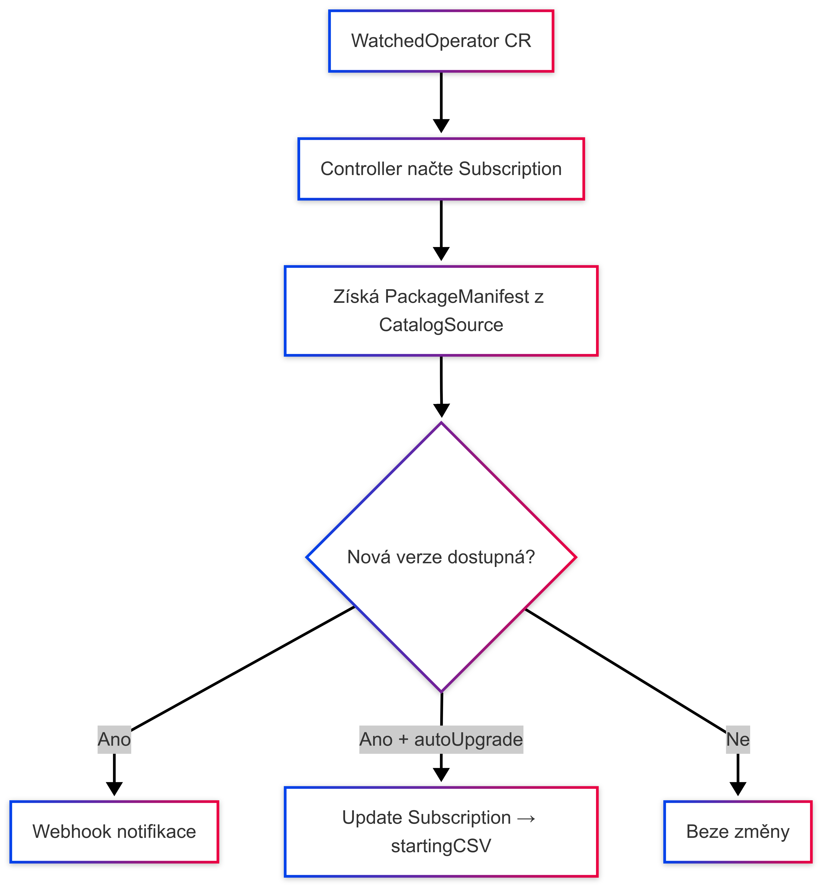

# Detaily fungování: Operator Lifecycle Operator

Tento operátor je navržen jako centrální správce životního cyklu operátorů běžících v OpenShift clusteru. Pomáhá zautomatizovat a zpřehlednit správu verzí jednotlivých operátorů nasazených pomocí OLM (Operator Lifecycle Manager).

---

## ⚙️ Komponenty a jejich úloha

### 1. `WatchedOperator` (CRD)
Záznam o tom, který operátor má být sledován.

| Pole | Význam |
|------|--------|
| `name` | Název Subscriptionu (např. `prometheus-operator`) |
| `namespace` | Namespace, kde Subscription běží |
| `channel` | Kanál aktualizací (např. `stable`) |
| `autoUpgrade` | Provést upgrade automaticky |
| `webhookURL` | Notifikace při nové verzi |

---

### 2. `OperatorUpgradeRequest` (CRD)
Slouží k ručnímu spuštění upgradu na zvolenou verzi.

---

### 3. Detekce nové verze
Operátor získá informace z objektu `PackageManifest` (z `openshift-marketplace`) a porovná aktuální `InstalledCSV` se `LatestCSV`.

---

### 4. Automatický upgrade
Pokud je `autoUpgrade: true`, operátor:
- nastaví `.spec.startingCSV` ve `Subscription`
- provede aktualizaci

---

### 5. Webhook notifikace
Pokud je nastavena `webhookURL`, odešle JSON payload s informací o nové verzi:

```json
{
  "operator": "prometheus-operator",
  "current": "v0.71.0",
  "latest": "v0.72.0",
  "message": "New version available"
}
```

---

## 🔗 Průběh



---

## 📥 CLI integrace

```bash
oc-lifecycle register prometheus-operator --channel stable
oc-lifecycle upgrade prometheus-operator --to v0.72.1
```

---

## ✅ Výhody

- Automatizace aktualizací operátorů
- Přehled o dostupnosti nových verzí
- Možnost ručního i automatického upgradu
- Integrace s CI/CD, Slack, MS Teams

---

## 💡 Možná rozšíření

- UI plugin pro OpenShift Console
- Podpora rollbacku
- Slack formát zpráv
- Historie změn

---
